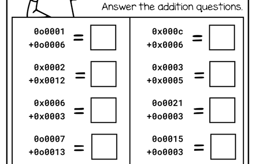
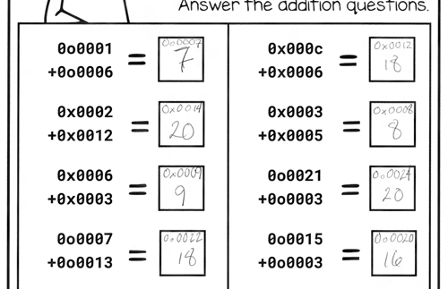

# number-system-worksheet
A script to pair with a math worksheet, in the style of first-grade math (but cursed by its use of four number systems: decimal, binary, octal and hexadecimal).

## Prepare a Worksheet

As a teacher, you will need to find your own math-worksheet template. There are lots of good ones online, but often they are protected by a minimal fee on websites like [teacherspayteachers.com](https://www.teacherspayteachers.com/browse/elementary/1st-grade/math). 

The script generates 12 random addition problems you can drop-in to any worksheet template, each with two numbers that sum to 20 or less. *(I've found putting straightforward limits on possible-answers for these problems helps students approach them with more confidence.)*

The teacher can then populate the worksheet with these problems and have students solve them. See the snippet of an example worksheet below, for inspiration. 

## Solve the Math Problems
The script continues with a basic calculator that allows users to input addition problems in different number systems. The calculator supports decimal, binary, octal, and hexadecimal numbers. It only supports addition and will convert the numbers to decimal before performing the operation.

The result will be displayed in the same number system as the input numbers, as well as in decimal.

This is primarily a feature so the teacher can verify the student's answers. 😅 See the example below with answer I populated using the script: 

## Extending this script
This short Python script is fairly limited, but it is also:
- easily readable by students in [APCSP](https://apcentral.collegeboard.org/courses/ap-computer-science-principles)/[Python](https://www.python.org/)
- easily modified to include other operators ( `-`, `*`, `/`, `%`)
- can be extended in pretty much any way you like
- tries to conform to best-ish practices (while staying approachable for students)